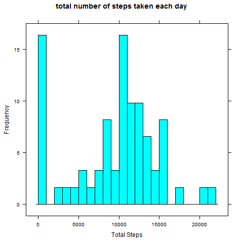

Loading required library
------------------------

    library(lattice)

------------------------------------------------------------------------

Downloading data
----------------

    url <- "https://d396qusza40orc.cloudfront.net/repdata%2Fdata%2Factivity.zip"
    download.file(url,"data.zip")
    unzip("data.zip",exdir = "data")

------------------------------------------------------------------------

Loading and preprocessing the data
----------------------------------

Show any code that is needed to

#### 1. Load the data (i.e. read.csv())

#### 2. Process/transform the data (if necessary) into a format suitable for your analysis

    filename <- paste("./data",list.files("data"), sep = "/")
    activity <- read.csv(filename, header = TRUE, colClasses = c("numeric","character","numeric"), na = "NA")

What is mean total number of steps taken per day?
-------------------------------------------------

    For this part of the assignment, you can ignore the missing values in the dataset.

#### 1. Calculate the total number of steps taken per day

    stepsdata <- aggregate(activity$steps, by =list(activity$date), FUN = sum, na.rm =TRUE)
    names(stepsdata) <- c("date", "total.steps")

#### 2. If you do not understand the difference between a histogram and a barplot, research the difference between them. Make a histogram of the total number of steps taken each day

    histogram(stepsdata$total.steps, xlab = "Total Steps",ylab = "Frequency", main ="total number of steps taken each day", breaks =  20)

#### 3. Calculate and report the mean and median of the total number of steps taken per day

    beforestepsmean <- mean(stepsdata$total.steps, na.rm = TRUE)
    beforestepsmedian <- median(stepsdata$total.steps, na.rm = TRUE)
    beforestepsmean

    ## [1] 9354.23

    beforestepsmedian

    ## [1] 10395

------------------------------------------------------------------------

What is the average daily activity pattern?
-------------------------------------------

#### 1. Make a time series plot (i.e. type = "l") of the 5-minute interval (x-axis) and the average number of steps taken, averaged across all days (y-axis)

    intervaldata <- aggregate(x= list(steps = activity$steps), by =list(interval = activity$interval), FUN = mean, na.rm = TRUE)
    xyplot(intervaldata$steps ~ intervaldata$interval, type = "l", xlab ="5-minute interval", ylab = "the average number of steps taken", main = "Average daily activity pattern")

#### 2. Which 5-minute interval, on average across all the days in the dataset, contains the maximum number of steps?

    maxintervalsteps <- intervaldata[which.max(intervaldata$steps),]
    maxintervalsteps

    ##     interval    steps
    ## 104      835 206.1698

-   5-minute interval with maximum number of steps: 835

------------------------------------------------------------------------

Imputing missing values
-----------------------

    Note that there are a number of days/intervals where there are missing values (coded as NA). The presence of missing days may introduce bias into some calculations or summaries of the data. 

#### 1. Calculate and report the total number of missing values in the dataset (i.e. the total number of rows with NAs)

    emptydata <- is.na(activity$steps)
    table(emptydata)

    ## emptydata
    ## FALSE  TRUE 
    ## 15264  2304

#### 2. Devise a strategy for filling in all of the missing values in the dataset. The strategy does not need to be sophisticated. For example, you could use the mean/median for that day, or the mean for that 5-minute interval, etc.

    fill.data <- function(activity){
            for (i in 1:nrow(activity)){
                    if(is.na(activity[i,1])){
                            activity[i,"steps"] <- intervaldata[intervaldata$interval == activity[i,"interval"],"steps"] 
                    }
            }
            return(activity)
    }

#### 3. Create a new dataset that is equal to the original dataset but with the missing data filled in.

    activityfilled <- fill.data(activity)

#### 4. Make a histogram of the total number of steps taken each day and Calculate and report the mean and median total number of steps taken per day. Do these values differ from the estimates from the first part of the assignment? What is the impact of imputing missing data on the estimates of the total daily number of steps?

    stepsdata <- aggregate(activityfilled$steps, by =list(activityfilled$date), function(x){sum(x)})
    names(stepsdata) <- c("date","total.steps")
    histogram(stepsdata$total.steps, xlab = "Total Steps", ylab = "Frequency", main ="total number of steps taken each day", breaks =  20)

    afterstepsmean <- mean(stepsdata$total.steps, na.rm = TRUE)
    afterstepsmedian <- median(stepsdata$total.steps, na.rm = TRUE)
    afterstepsmean

    ## [1] 10766.19

    afterstepsmedian

    ## [1] 10766.19

When NA was removed, there was 53 days records for steps in different
interval. 8 records were removed and the mean and median was calculated.
After replacing 8 records with mean of that interval, mean and median
changes.

Are there differences in activity patterns between weekdays and weekends?
-------------------------------------------------------------------------

    For this part the weekdays() function may be of some help here. Use the dataset with the filled-in missing values for this part.

#### 1. Create a new factor variable in the dataset with two levels – “weekday” and “weekend” indicating whether a given date is a weekday or weekend day.

    get_day <- function(date){
            weekday <- weekdays(as.Date(date))
            if(weekday %in% c("Monday", "Tuesday", "Wednesday", "Thursday", "Friday")){
                    return("weekday")
            } else if(weekday %in% c("Saturday", "Sunday")){
                    return("weekend")
            } else {
                    stop("Not a valid date")
            }
    }

    tempdata <- activityfilled
    tempdata$weekday <- sapply(tempdata$date, FUN = get_day)

#### 2. Make a panel plot containing a time series plot (i.e. type = "l") of the 5-minute interval (x-axis) and the average number of steps taken, averaged across all weekday days or weekend days (y-axis). See the README file in the GitHub repository to see an example of what this plot should look like using simulated data.

    aggdata <- aggregate(steps ~ interval + weekday, data=tempdata, mean)
    with(aggdata,
         xyplot(steps ~ interval | weekday, type="l", xlab = "Interval", ylab = "Number of steps", layout = c(1, 2)))

